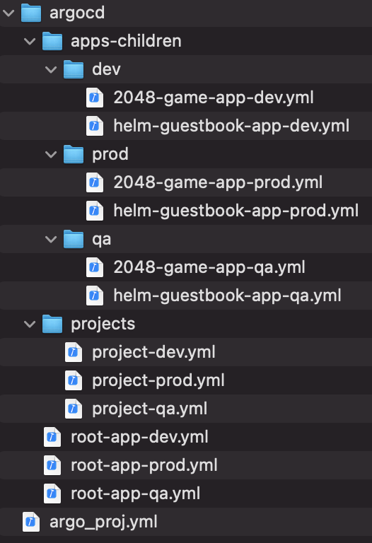
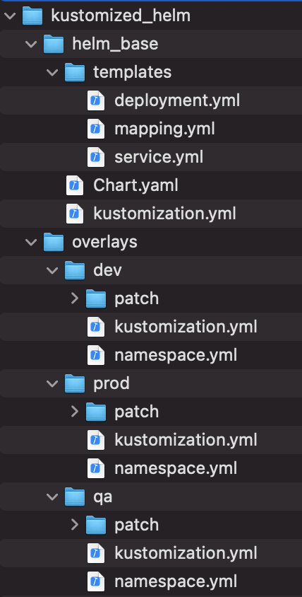

# ArgoCD App Bootstrap

Take the headache out of deploying apps on k8s via ArgoCD with some templating and magic.

# Pre-Requisites

To make the most out of this code, you'll need a Kubernetes cluster running ArgoCD. Not sure how to install ArgoCD on your cluster? Check out this handy-dandy tutorial [here](https://medium.com/dzerolabs/installing-ambassador-argocd-and-tekton-on-kubernetes-540aacc983b9).

You also need to be running Python >=3.8 if you want to run the code locally. Alternatively, you can run the code from within Docker. [Image provided](docker/Dockerfile). Obviously, if you go that route, you'll need to have Docker installed.

You can check out our other ArgoCD-themed tutorials:
* [Using Tekton and ArgoCD to Set Up a Kubernetes-Native Build & Release Pipeline](https://medium.com/dzerolabs/using-tekton-and-argocd-to-set-up-a-kubernetes-native-build-release-pipeline-cf4f4d9972b0)
* [Configuring SSO with Azure Active Directory on ArgoCD](https://medium.com/dzerolabs/configuring-sso-with-azure-active-directory-on-argocd-d20be4ba753b)
* [Turbocharge ArgoCD with App of Apps Pattern and Kustomized Helm](https://medium.com/dzerolabs/turbocharge-argocd-with-app-of-apps-pattern-and-kustomized-helm-ea4993190e7c)

# Quickstart

>NOTE: I am using Fish as my default shell. You'll need to make adjustments in some spots if you're using Bash.

## Local Python Setup

To keep things neat, I like to use Python virtual environments. Set up your virtual environment by running the commands below:

```bash
pip install venv
virtualenv venv
source  venv/bin/activate.fish
python -m pip install --upgrade pip
pip install --upgrade --force-reinstall -r requirements.txt
```

### PreCommit Config

I use `pre-commit` to format my Python code so that it's consistent across the board. It's installed as part of `requirements.txt`

Once `pre-commit` is installed, run the commands below to set up the tool.

```bash
pre-commit install
pre-commit run --all-files
```

## ArgoCD CLI Installation in a Dockerfile

Since the ArgoCD CLI installation instructions don't seem to work when building a Dockerfile, I've downloaded a copy of the binary to this repo, which then I copy when building the Dockerfile. Since it's a big file, you need `git-lfs` when adding to the repo.

To install `git-lfs`:

```bash
brew install git-lfs
git lfs install
git lfs track argocd-linux-amd64
```

>NOTE: If you've figured out how to build a Dockerfile with the ArgoCD CLI that's less convoluted than my process, please, SHARE YOUR KNOWLEDGE!!

## Install ArgoCD CLI from Your Own API Server

Fun fact: you can install the ArgoCD CLI from your ArgoCD cluster, rather than from [ArgoCD's GitHub repo](https://argoproj.github.io/argo-cd/cli_installation/).

One reason why you might choose this route is that it ensures parity between your CLI version and the version running on your k8s cluster.

Reference: [ArgoCD Docs](https://argoproj.github.io/argo-cd/user-guide/ci_automation/#synchronize-the-app-optional)

* Mac: `http://<argocd_server>/argo-cd/download/argocd-darwin-amd64`
* Windows: `http://<argocd_server>/argo-cd/download/argocd-windows-amd64.exe`
* Linux: `http://<argocd_server>/argo-cd/download/argocd-linux-amd64`

## Run the Code Locally Using Python Invoke

To run the code locally using Python Invoke:

>**NOTE:** I'm using Fish as my default shell. Please update accordingly for Bash.

```bash
set -x GIT_USERNAME
set -x GIT_TOKEN <git_token>
set -x GIT_REPO_URL <git_repo_url>
set -x ARGOCD_USERNAME admin
set -x ARGOCD_PASSWORD <argocd_password>
set -x ENV development
set -x TARGET_ENVIRONMENT "DEV"

# Set up App of Apps YAML
invoke --collection=argocd_app_bootstrap argo-setup.setup-app-of-apps

# Deploy App Bundle to ArgoCD
invoke --collection=argocd_app_bootstrap argo-run.deploy-app-bundle

# Cascade delete the ArgoCD App Bundle
invoke --collection=argocd_app_bootstrap argo-run.remove-app-bundle

# Removes all registered repos and projects from ArgoCD defined in argo_proj.yml
invoke --collection=argocd_app_bootstrap argo-run.remove-project argo-run.remove-repos

# Kubernetes deployment scaffolding (creates kustomized helm folder and some templated YAMLs)
invoke --collection=argocd_app_bootstrap deploy-setup.bootstrap-k8s-deployment

```

## Docker

To run code within the Docker container, let's first build the Dockerfile:.

Before running the Docker build, you'll have to do the following:
1. Modify `Line 45` in the [Dockerfile](docker/Dockerfile) to point to your own gcloud service account credentials JSON file. If you're not on gcloud, please modify the dockerfile accordingly.
2. Modify `Line 26` in [docker_build.sh](docker/docker_build.sh) to point to your own gcloud service account credentials JSON file. If you're not on gcloud, please modify the script accordingly.

>**NOTE:** You should check out this [blog post on Medium](https://medium.com/@jryancanty/stop-downloading-google-cloud-service-account-keys-1811d44a97d9) if you want to impersonate a service account instead. Honestly, it's a better idea. I just haven't gotten to it myself.

Now run the build.

```bash
# Build
./docker/docker_build.sh <tag_name>
```

Run the image:

```bash
# Run
docker run -it --rm \
    --network host \
    --name argocd-bootstrap \
    -e ENV="development_docker" \
    -e GIT_USERNAME="" \
    -e GIT_TOKEN="<git_token>" \
    -e GIT_REPO_URL="<git_repo_url>" \
    -e ARGOCD_USERNAME="admin" \
    -e ARGOCD_PASSWORD="<argocd_admin_password>" \
    -e TARGET_ENVIRONMENT="DEV" \
    argocdapp-bootstrap:1.0.0 "/bin/bash"
```

Once you're inside the container, play around by running the commands below:

```bash
# gcloud login, sets up kube config
./startup.sh

# Set up App of Apps YAML
argo-bootstrap argo-setup.setup-app-of-apps

# Deploy App Bundle to ArgoCD
argo-bootstrap argo-run.deploy-app-bundle

# Cascade delete the ArgoCD App Bundle
argo-bootstrap argo-run.remove-app-bundle

# Removes all registered repos and projects from ArgoCD defined in argo_proj.yml
argo-bootstrap argo-run.remove-project argo-run.remove-repos

# Kubernetes deployment scaffolding (creates kustomized helm folder and some templated YAMLs)
argo-bootstrap deploy-setup.bootstrap-k8s-deployment
```

>NOTE: `startup.sh` assumes that you're using `gcloud`. If you're on a different cloud provider, you'll need to modify accordingly.

# The Tool

We're into the good stuff now.

The purpose of this tool is to allow for making it easier to implement ArgoCD's App of Apps pattern. It generates the necessary files and folder structure described in our blog post about the [App of Apps Pattern](https://medium.com/dzerolabs/turbocharge-argocd-with-app-of-apps-pattern-and-kustomized-helm-ea4993190e7c).

First, have a quick refresher on some useful terms.

>An **App Bundle** is a group of related microservices.

>An **App Manifest** refers to all of the YAML definitions that make your microservices run on Kubernetes. For example, a `Service` resource definition and a `Deployment` resource definition. 

This tool reads a file called `argo_proj.yml` to create an `AppProject` YAML and all of the `Application` YAMLs for the microservices being grouped together for a particular App Bundle. Keeping in mind that applications are often deployed to different environments, these files are created for `DEV`, `QA`, and `PROD` environments.

The `argo_proj.yml` looks something like this:

```yaml
argocd:
  project:
    name: appbundle-project
    description: The app bundle POC project
  parent_app:
    name: appbundle
    repo_url: https://github.com/d0-labs/argocd-app-of-apps-parent
    version: 1.0
  child_apps:
    destination_cluster: in-cluster
    app:
    - name: helm-guestbook
      repo_url: https://github.com/d0-labs/argocd-app-of-apps-child-guestbook
      namespace: helm-guestbook
      manifest_path: kustomized_helm/overlays/dev
      deploy_plugin: kustomized-helm
    - name: 2048-game
      repo_url: https://github.com/d0-labs/argocd-app-of-apps-child-2048-game
      namespace: 2048-game
      manifest_path: kustomized_helm/overlays/dev
      deploy_plugin: kustomized-helm
```

* `parent_app.repo_url`: The App Bundle repo. This is the repo in which the `Application` and `AppProject` YAML files will be created. This repo would be typically managed by an SRE team.
* `child_apps.destination_cluster`: The cluster to which the microservices apps will be deployed
* `app.repo_url`: The application repo in which the application code resides. This is typically managed by application developers.
* `app.manifest_path`: The location of the Kubernetes app manifests (i.e. Helm Charts, Kustomizations, `Service` definitions, `Deployment` definitions, etc.)
* `app.deploy_plugin`: The name of the [ArgoCD plugin](https://argoproj.github.io/argo-cd/user-guide/config-management-plugins/) to use, as configured in the [argocd-cm.yml](https://gist.github.com/avillela/c2abb14b1f03e3090eb08e55aca7cccc#file-customized-helm-argocd-cm-yml) file. We are assuming the use of a [kustomized-helm plugin](https://gist.github.com/avillela/c2abb14b1f03e3090eb08e55aca7cccc#file-customized-helm-argocd-cm-yml). If this field is ommitted, then ArgoCD will look for either Helm Charts, Kustomizations, or plain old YAML in the specified manifest path.

## What can you do with it?

So you've seen the main commands of the tool in the quickstart guide above. Here's a more detailed view of what they do.

Please note that I am assuming that you've got your ArgoCD up and running and configured, and have registered your clusters using `argocd cluster add`. For more on ArgoCD setup, please check out [this blog post](https://medium.com/dzerolabs/using-tekton-and-argocd-to-set-up-a-kubernetes-native-build-release-pipeline-cf4f4d9972b0).

### argo-bootstrap argo-setup.setup-app-of-apps

This action creates the `Application` and `AppProject` YAML files for the parent and child applications defined in the App Bundle repo. The files are created in the App Bundle repo (like [this one](https://github.com/d0-labs/argocd-app-of-apps-parent)), and have a file structure like this one:



Note how we're creating app bundles for 3 different k8s clusters (`DEV`, `QA`, `PROD`).

### argo-run.deploy-app-bundle

This action will:
* Register the repos associated with the parent and child apps defined in `argo_proj.yml`.
* Create the `AppProject` in ArgoCD for the target environment (i.e. either `DEV`, `QA`, or `PROD`). Remember that `TARGET_ENVIRONMENT` environment variable that you set in the Quickstart above? :)
* Create the parent and child `Application` in ArgoCD
* Deploy the applications to the target cluster for the given target environment (defined by `TARGET_ENVIRONMENT`)

### argo-run.remove-app-bundle

This action will perform a cascade delete of all parent and child resources, including app manifests, namespaces, and ArgoCD `Application` definitions. It does NOT delete the project or repo registrations.

### argo-run.remove-project argo-run.remove-repos

This action is actually 2 chained actions. The first action deletes the `AppProject` from ArgoCD. The second action unregisters the repos configured in `argo_proj.yml`.

You could technically create a single `invoke` task which chains them together without having to "manually" chain them as above.

### deploy-setup.bootstrap-k8s-deployment

This action will scaffold a folder structure for deploying applications to Kubernetes using [Kustomized Helm](https://jfrog.com/blog/power-up-helm-charts-using-kustomize-to-manage-kubernetes-deployments/). The folder structure looks like this:



Helm is used to template base variables (i.e. `.Release.Name`).

Kustomize is used to:
* Apply common namespace and labels to all YAML resources being Kustomized
* Handle environment-specific configuratoins (i.e. DEV, QA, PROD). This includes:
    * Number of replicas for the `Deployment` (via `patchesJson6902` in the `kustomization.yml`)
    * Number of seconds for the livenessProbe for the `Deployment` (via `patchesJson6902` in the `kustomization.yml`)
    * Image name and tag (via `images` in the `kustomization.yml`)
